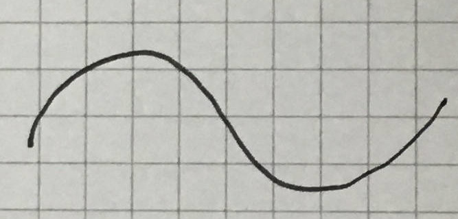
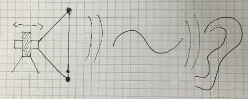

class: center, middle

# The (somewhat) musical Ruby
## 0.0.1-alpha.1
## Jan 'half/byte' Krutisch
## @halfbyte
---
# But first!
---

# Human Beatboxing 101

---

# Three fundamental sounds

---

# Bass drum (Kick drum)
- Boo
- Dmm

---

# Snare Rimshot
- Pfff
- Kh
- Krrr

---

# Hihat / Cymbal
- Tssss
- Ts

---

# Bootsssss ... Catssss

---

# A couple of names to google
- Lia Sahin
- Kawehi
- Beardyman
- Sly the Mic Buddah
- Romybeats
---

class: center, middle, depfu, contain
background-image: url(images/depfu-left-blue.png)
---
class: contain
background-image: url(images/depfu_example.png)

---

# Let's start high level

---

# SonicPi

## by Sam Aaron

---

# Let's dig deeper

---

# Let's make music with pure ruby

---

```ruby
SAMPLING_FREQUENCY=44100
FREQUENCY=440

in_cycle = 0
samples = SAMPLING_FREQUENCY.times.map do
  period = SAMPLING_FREQUENCY / FREQUENCY.to_f
  output = in_cycle > 0.5 ? -1.0 : 1.0
  in_cycle = (in_cycle + (1.0 / period)) % 1.0
  output *= 0.5
end
print samples.pack('e*')

```

---

# How to play?

---

# SoX to the rescue

---
# Lance Norskog
# Chris Bagwell
# (and many others)

(It started in 1991. yeah.)

---

```bash
#!/bin/bash
ruby $1 | play -t raw -b 32 -r 44100 -c 1 \
  -e floating-point --endian little -
```
---

<audio src="samples/square.wav" data-player="scope">

---

# But how does it work

---

# Like, how does it really work.

---

# What is sound

---

# Pushing air particles


---

# A tone


---

# the full


---

# Electrical current > Air movement

---

# Digital Data > Electrical current

---

# Digital to Analog Converter (DAC)


---

# Two problems

1. Sampling Frequency
2. Sample Resolution

---

# Sampling frequency vs. expressable frequencies


---

# Nyquist - Shannon


<math>
  <mrow>
    <msub><mi>F</mi> <mi>max</mi></msub> = <mfrac><msub><mi>F</mi><mi>sample</mi></mi></msub>2</mfrac>
  </mrow>
</math>

---
# So why 44,1 kHz?

---
# Human hearing range

## F<sub>max</sub> ~ 20000 Hz
## F<sub>sample</sub> ~ 40000 Hz
## Reasons.

---

# Sample Resolution

---

# 8 Bit / 16 Bit / 24 Bit

---

# Float vs. Int


---
# Better is not always better
- Higher sample rate, higher bitcount => More storage
- Storage was at a premium (CD's hold ~ 700 MB)
- Good enough is perfect

# But
- Editing, Modifying: Overhead is good
- 96 kHz, 24 Bit is standard

---
# A squarewave at 440 Hz

<audio src="samples/square.wav" data-player="scope">

---
# A squarewave at 440 Hz (Frequency domain)

<audio src="samples/square.wav" data-player="fft">

---

# Yes I know it sounds horrible

---

# Subtractive Synthesis

---

- Start with high harmonic content
- Filter down

(think sculpting)

---

# Filter?!?

---

# State Variable Filter


---

```ruby
def run(input, frequency, q, type: :lowpass)
  # derived parameters
  q1 = 1.0 / q.to_f
  f1 = 2 * Math::PI * frequency / @sampling_frequency

  # calculate filters
  lowpass = @delay_2 + f1 * @delay_1
  highpass = input - lowpass - q1 * @delay_1
  bandpass = f1 * highpass + @delay_1
  notch = highpass + lowpass

  # store delays
  @delay_1 = bandpass
  @delay_2 = lowpass
  # [...]
end
```


---

<audio src="samples/acid_synth.wav?f=1" data-player="fft">

---

---
class: depfu, middle, center
# ❤️ Thank you ❤️
## halfbyte/rubysynth
## 🎹 ✏️
## @halfbyte
## depfu.com
