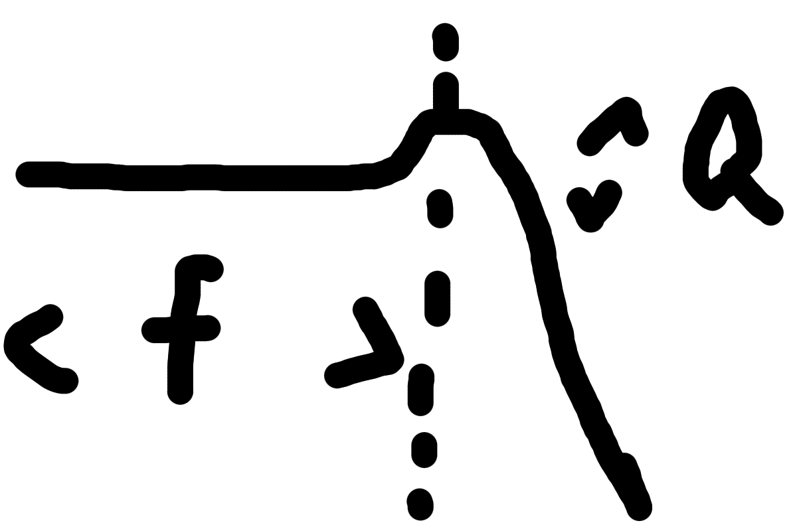
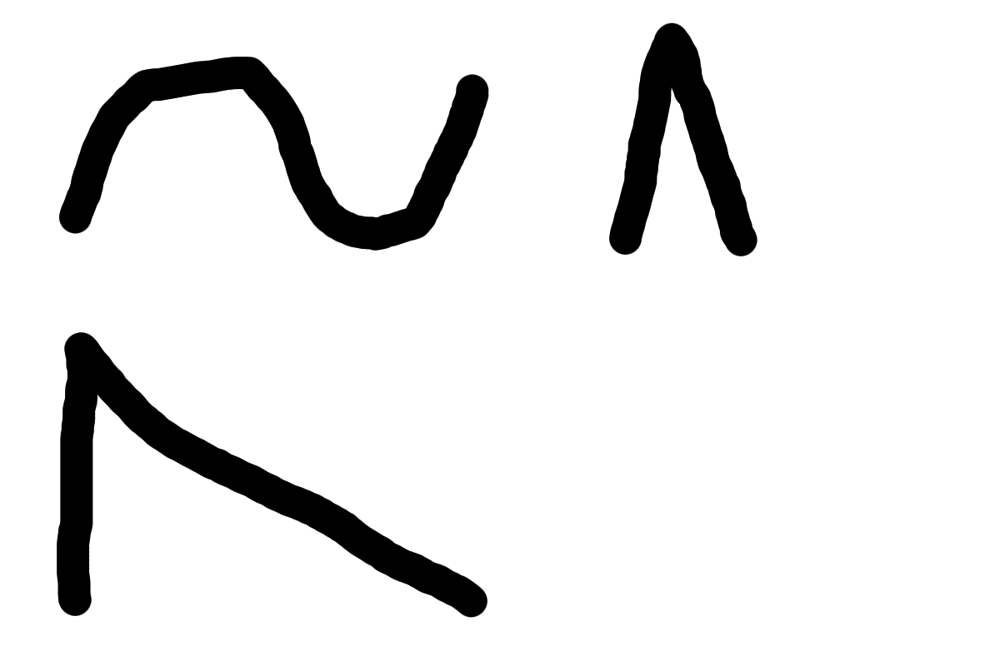
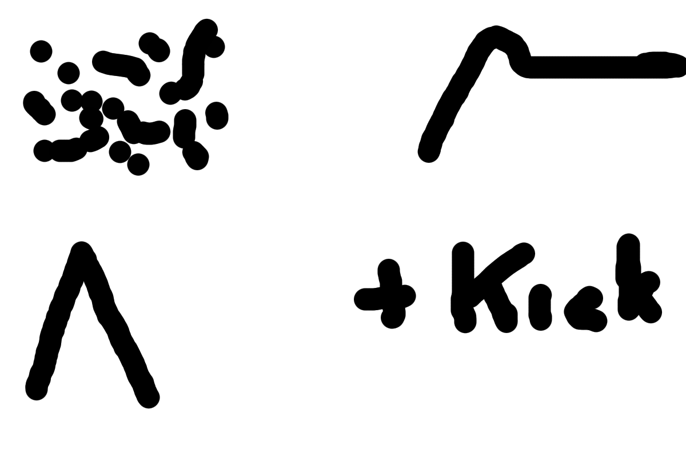
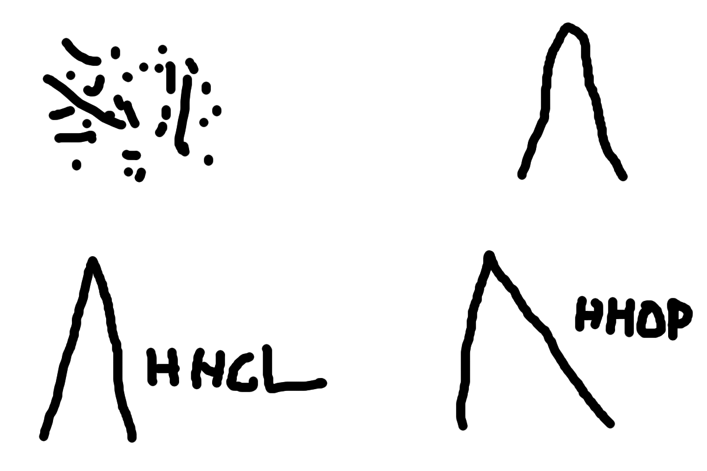
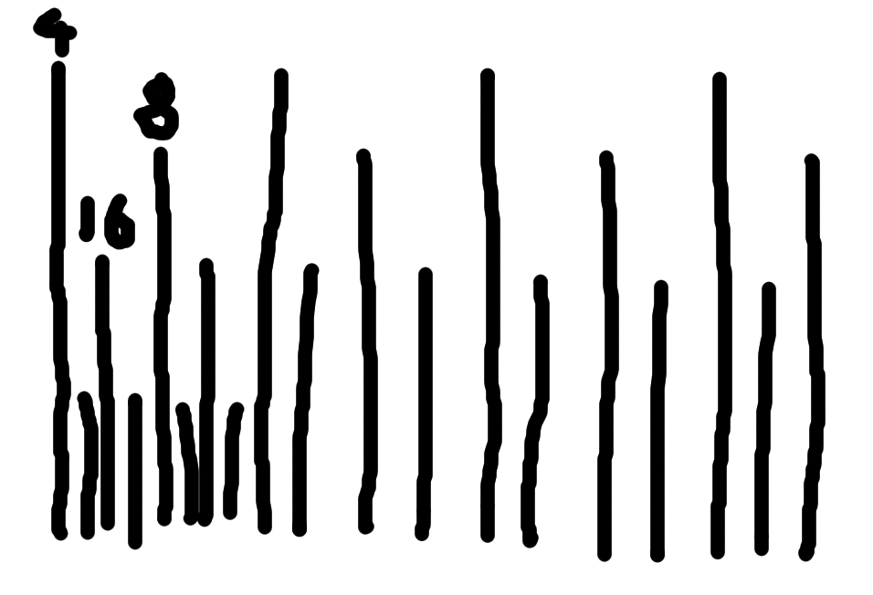

class: center, middle, title

# The musical Ruby
## A presentation for Euruko 2019

## Jan 'half/byte' Krutisch
## @halfbyte

---
class: center, middle, depfu, contain
background-image: url(images/depfu-left-blue.png)
---
class: contain
background-image: url(images/depfu_example.png)

---
class: center, middle, subtitle
# A warning
---
### Don't try to understand the code examples!

Note: This not meant as an insult. I'm just aware that it's a lot of code on very different subjects and it will be next to impossible to understand it during the presentation. Instead, go to [halfbyte/ruby_for_artists](https://github.com/ruby_for_artists) and study the examples there.

I'm providing the code fragments here to give you a sense of how much (or rather: how little) code is necessary and how the code looks in general. More of a teaser or taste bite than actually explaining how a library works.

The reason I have (in contrast to what every one tells you to do) a looong text on one slide is that I want to warn people who click through these slides later on.

(If you're sitting in the audience and you made it this far, please clap your hands twice.)
---
class: center, middle, subtitle
# Music
---
class: center, middle
# Let's start high level

---
class: center, middle
# SonicPi

## by Sam Aaron
---
class: center, middle
# Let's dig deeper

---
class: center, middle
# Pure Ruby
# (+ SoX)
---
# SoX
## Lance Norskog
## Chris Bagwell
## (and many others)
(It started in 1991. yeah.)
---
```ruby
SAMPLING_FREQUENCY=44100
FREQUENCY=440

in_cycle = 0
samples = SAMPLING_FREQUENCY.times.map do
  period = SAMPLING_FREQUENCY / FREQUENCY.to_f
  output = in_cycle > 0.5 ? -1.0 : 1.0
  in_cycle = (in_cycle + (1.0 / period)) % 1.0
  output * 0.5
end
print samples.pack('e*')

```

```bash
#!/bin/bash
# play.sh
ruby $1 | play -t raw -b 32 -r 44100 -c 1 \
  -e floating-point --endian little -
```

---
class: center, middle
<audio src="samples/square.wav" data-player="simple"></audio>

---
class: center, middle
# But how does it work?

---
class: center, middle

# Like, how does it really work.

---
class: center, middle

# What is sound

---
class: center, middle

# Vibrating air molecules


---
class: center, middle

# The full system


---
class: center, middle, frame-image

# Electrical current > Air movement
## Loudspeaker


---
class: center, middle

# Digital Data > Electrical current
## Digital to Analog Converter (DAC)

---
class: center, middle
# Digital to Analog challenges


<math>
  <mrow>
    <msub><mi>F</mi> <mi>max</mi></msub> = <mfrac><msub><mi>F</mi><mi>sample</mi></mi></msub>2</mfrac>
  </mrow>
</math>

???
- Two problems:
  - Sampling frequency
    - Nyquist shannon, 2 * Fmax
    - ~ 40 kHz is enough, 20 kHz humans plus headroom
  - Sampling resolution
    - Enough is enough
---
class: center, middle, subtitle
# A Ruby Synth

---
```ruby
SAMPLING_FREQUENCY=44100
FREQUENCY=440

in_cycle = 0
samples = SAMPLING_FREQUENCY.times.map do
  period = SAMPLING_FREQUENCY / FREQUENCY.to_f
  output = in_cycle > 0.5 ? -1.0 : 1.0
  in_cycle = (in_cycle + (1.0 / period)) % 1.0
  output *= 0.5
end
print samples.pack('e*')
```

---
class: center, middle
# A squarewave at 440 Hz

<audio src="samples/square.wav" data-player="scope"></audio>

---
class: center, middle
# Why 440 Hz?

---

class: center, middle
# 440 Hz = Concert Pitch
# A above middle C

---
class: center, middle
# Should it be 432 Hz?
---
class: center, middle
# Western notation
---
class: center, middle
# 1 Octave up = Double Frequency
# 1 Octave down = Half Frequency
---
class: center, middle
# 1 Octave = 12 Halftones
# C, C#, D, D#, E, F,
# F#, G, G#, A, A#, B
---
class: center, middle
# 1 Octave = 12 Halftones
# C, D♭, D, E♭, E, F,
# G♭, G, A♭, A, B♭, B
---
class: center, middle
# Tuning / Temperament
## (in short: it's complicated)
---
class: center, middle
# There's a standard for that
# (MIDI)
---
class: center, middle

<math>
  <mrow>
    <msup><mn>2</mn><mfrac><mrow><mi>n</mi><mo>-</mo><mn>69</mn></mrow><mn>12</mn></mfrac></msup><mo>*</mo><mn>440</mn><mu>Hz</mu>
  </mrow>
</math>

---

class: center, middle
# n = MIDI note (0-127)
# 0 = very low C
# 60 = middle C

---

class: center, middle
# A squarewave at 440 Hz

<audio src="samples/square.wav" data-player="fft"></audio>
---
class: center, middle
# Yes I know it sounds horrible
---
class: center, middle, subtitle
# Sculpting a sound
---
class: center, middle
# Subtractive Synthesis

---
class: center, middle
1. Start with high harmonic content
2. Filter down

---
class: center, middle

# Filter?!?

---
class: center, middle
# State Variable Filter


---

# State Variable Filter
```ruby
def run(input, frequency, q, type: :lowpass)
  # derived parameters
  q1 = 1.0 / q.to_f
  f1 = 2 * Math::PI * frequency / @sampling_frequency

  # calculate filters
  lowpass = @delay_2 + f1 * @delay_1
  highpass = input - lowpass - q1 * @delay_1
  bandpass = f1 * highpass + @delay_1
  notch = highpass + lowpass

  # store delays
  @delay_1 = bandpass
  @delay_2 = lowpass
  # [...]
end
```
---
class: center, middle
# Lowpass



---
class: center, middle
# A filtered squarewave at 440 Hz

<audio src="samples/filtered.wav" data-player="fft"></audio>
---
class: center, middle
# Something's still wrong
---
class: center, middle
# Piano
TODO: Add Piano sound
---
class: center, middle
# Variance over time
---
class: center, middle
# Envelopes to the rescue
---
class: center, middle
# Not this
# ✉
---
class: center, middle
# This!
<video src="images/adsr.ogg?aa" controls></video>
---
class: small-code
```ruby
def linear(start, target, length, time)
  (target - start) / length * time + start
end

def run(t, released)
  if !released
    if t < 0.0001 # initialize start value (slightly hacky, but works)
      @start_value = @value
      return @start_value
    end
    if t <= a # attack
      return @value = linear(@start_value, 1, a, t)
    end
    if t > a && t < (a + d) # decay
      return @value = linear(1.0, s, d, t - a)
    end
    if t >= a + d # sustain
      return @value = s
    end
  else # release
    if t <= a # when released in attack phase
      attack_level = linear(@start_value, 1, a, releases)
      return linear(attack_level, 0, t - released)
    end
    if t > a && t < (a + d) # when released in decay phase
      decay_level = linear(1.0, s, d, released - a)
      return @value = linear(decay_level, 0, r, t - released)
    end
    if t >= a + d && t < released + r # normal release
      return @value = linear(s, 0, r, t - released)
    end
    if t >= released + r # after release
      return @value = 0.0
    end
  end
end

```
---
class: center, middle
# Shape everything!
---
class: center, middle
# Volume / Amplitude
``` ruby
# [...]
env = Adsr.new(0.001, 0.2, 0.5, 0.2)
t = i.to_f / SAMPLING_FREQUENCY.to_f
stopped = t >= 0.5 ? 0.5 : nil
output *= 0.3 * env.run(t, stopped)
```
---

class: center, middle
# Volume / Amplitude
<audio src="samples/amp_env.wav" data-player="scope"></audio>
---
class: center, middle
# Filter Frequency
``` ruby
# [...]
filter_env = Adsr.new(0.01, 0.1, 0.1, 0.1)
t = i.to_f / SAMPLING_FREQUENCY.to_f
stopped = t >= 0.5 ? 0.5 : nil
output = filter.run(output, 500.0 + (8000.0 * filter_env.run(t, stopped)), 1)
```
---
class: center, middle
# Filter Frequency
<audio src="samples/filter_env.wav" data-player="fft"></audio>
---
class: center, middle
# Pitch
``` ruby
# [...]
pitch_env = Adsr.new(0.01, 0.2, 0.0, 0.0)
t = i.to_f / SAMPLING_FREQUENCY.to_f
stopped = t >= 0.5 ? 0.5 : nil
period = SAMPLING_FREQUENCY / (FREQUENCY.to_f * ((0.2 * pitch_env.run(t, stopped)) + 1))
```
---
class: center, middle
# Pitch
<audio src="samples/pitch_env.wav" data-player="fft"></audio>
---
class: center, middle
# LFO
## (Low Frequency Oscillator)
---
class: center, middle
# LFO on Filter
``` ruby
lfo = Oscillator.new(SAMPLING_FREQUENCY)
lfo_freq = 4
# [...]
output = filter.run(
  output,
  500.0 + ((lfo.run(lfo_freq, waveform: :sawtooth) + 1) * 2000.0),
  2
)
```
---
class: center, middle
# LFO on Filter
<audio src="samples/lfo_wub.wav" data-player="scope"></audio>

---
class: center, middle, subtitle
# Drums
---
class: center, middle, frame-image
# Kick drum

---
class: center, middle, frame-image
# Kick drum synthesized

---

class: center, middle, frame-image
# Snare drum

---
class: center, middle, frame-image
# Snare drum synthesized

---
class: center, middle, frame-image
# Hihat

---
class: center, middle, frame-image
# Hihat synthesized

---
class: center, middle, subtitle
# Sound --> Music
---
class: center, middle
# Sequencing sounds
---
class: center, middle
# Beats, bars and s\*\*t
---
class: center, middle
# Measure of 4 / 4
---
class: center, middle
# 1, 2, 3, 4
## (4 beats in a bar)
## (beat == 1/4 note)
(yes, music counts from 1 - yes, that confuses me)
---
class: center, middle
# A bar

---
---
# Tempo
## BPM (Beats per minute)
## (= Quarter notes per minute)
---

# Sequencer maths
``` ruby
BPM = 120
beat_length_in_seconds = 60 / BPM # = 0.5s
bar_length = beat_length_in_seconds * 4 # = 2s
sixteenth_note_length = beat_length_in_seconds / 4 # = 0.125s

```


---
class: depfu, middle, center
# ❤️ Thank you ❤️
## halfbyte/rubysynth
## 🎹 ✏️
## @halfbyte
## depfu.com


---
# Image Sources
- [DAC chip](https://commons.wikimedia.org/wiki/File:CirrusLogicCS4282-AB.jpg)
- [Loudspeaker](https://commons.wikimedia.org/wiki/File:Loudspeaker_side_en.svg)
- [Kick drum](https://commons.wikimedia.org/wiki/File:Bass_drum_Premier_(8639408589).jpg)
- [Snare drum](https://commons.wikimedia.org/wiki/File:Snare_drum_(line_art)_(PSF_S-860001_(cropped)).png)
- [Hihat](https://commons.wikimedia.org/wiki/File:Hi-hat.jpg)
