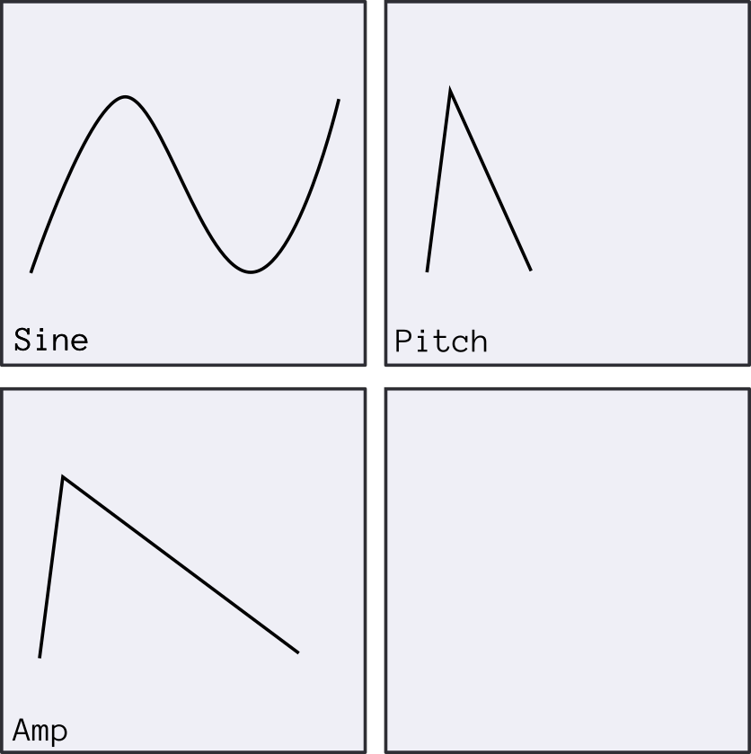
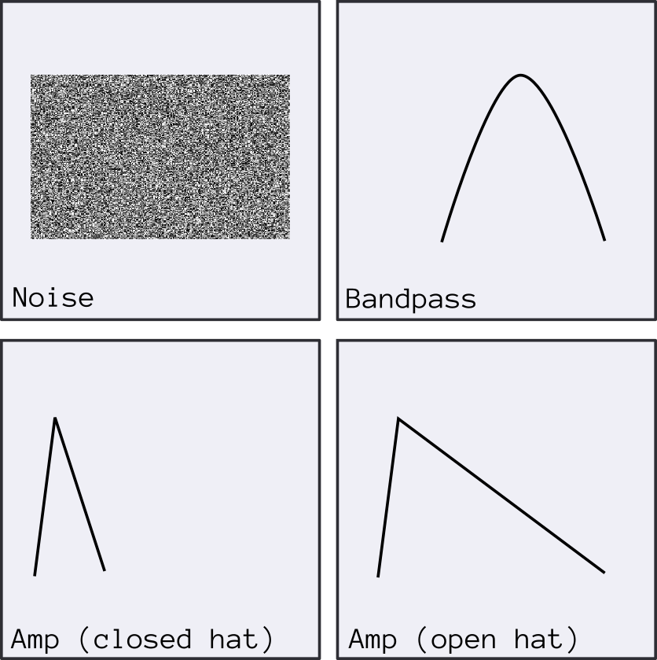

# Drum Sounds

We're now perfectly equipped to create some lush or harsh synthesizer sounds, so we should be able to make some good ambient music. But while I do like me some good ambient, I'm more of a dance music kind of guy and for that we're missing an important part. Now, I could cheat here and just use sampling - That's what most dance music producers nowadays do, but that would be cheating, right?

Additionally, if you look at how music styles like House and Techno came about, they were literally based on the sounds of two drum machines, both from Roland, the TR-808 and the TR-909 - The 808 is using analog synthesis for everything while the 909 uses a limited amount of samples - So generating drums with the sythesizing technologies we've explored so far would give us a good understanding of how these machines worked.

# Kick drum


Let's start with the foundation of every house or techno groove, the bassdrum or kickdrum. If you analyze the sound of an accoustic kick drum (or basically any drum with a similar design with a drum head and a drum corpus), as if you were a Roland engineer in the 80's, you'll notice two very distinct parts of a drum sound. The sharp attack, when the drum stick hits the skin of the drum head, which is really more like a shark click and then the sound of the drum body, where the full body including the two skins (and the air trapped in them) vibrates.

To simulate these two parts, We can use a sine wave (or a filtered down squarewave) and quickly modulate it's pitch from a relatively high value to a relatively low value. By varying the speed and the two frequencies, we can get a surprising amout of different percussion sounds and some of them do sound like a bassdrum.



In this example, I've also modulated the filter in a way so that it is a bit more open at the very beginning, adding to that sharpness of the first attack.

# Snare drum


.png)
A snare drum is, together with the kick drum, the backbone of every rock groove. What a snare drum is, esentially, is a tom, so a midsized drum, that has a so called snare carpet that lies on the bottom drum skin. This leads to the characteristic noisy sound of a snare that is much more than just the sound of the drum, which would sound like this.

To construct a snare sound, we pretty much need two components - A version of our kick drum sound that is just slightly pitched up (as a smaller drum usually creates a higher pitche sounds), like this, and then something to emulate the snares. To me, this actually sounds a lot like white noise and so that's what we're going to use. White noise is surprisingly easy to create:

```ruby
noise_out = rand * 2.0 - 1.0
```

On top of that, we're going to emulate the snare wires being a bit more bright in the beginning and then dampening down while they settle by putting a lowpass filter on top with an envelope shaping the sound a little it. Of course I aso put another envelope on the volume.


# Hihat


This is our last drum sound. The hihat, in a traditional drum kit, looks like this - It's essentially two cymbals on top of each other and you can move them together with a foot pedal, resulting in either very short or longer sounds.

Our hihat emulation will be somewhat crude, but it will actually work quite well within the groove we want to build with this.

Again, we'll start with white noise. Having a shorter or longer decay on our volume envelope gives us the chance to emulate an open or a closed hihat. By adding a static filter, a bandpass in this case, we can sort of tune the noise into something that at least starts to sound like a real hihat. To be honest, in my own music, I often favour these clean sounding hihats to accoustic ones.


