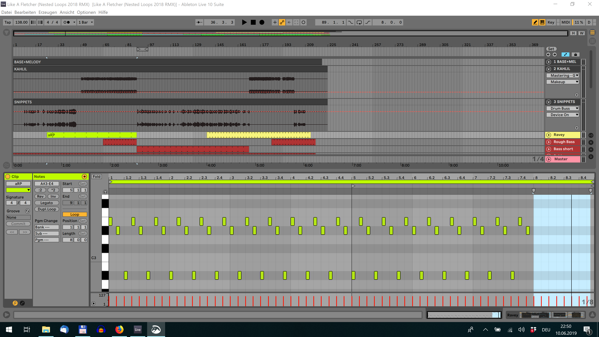

# Sequencing basics

Now that we have our sound repertoire, we can start to think about how to turn these single sounds into actual music.

For that, we need to learn a little about sequencing and rhythm.

## A bar and a beat

Most modern dance music (as is most music you would hear on the radio) is writting in a straight 4/4 metric. But what does that mean?

It means that a measure (or bar) of our music is comprised of four quarter notes. A quarter note in in this measure represents a beat.

I'm not going to go into more detail about rhythm, because the 4/4 is so easy to work with and this can get complicated very quickly - just one quick example of a different beat, here's a 6/8 walz.

Tempo in music is often measured in beats per minute or short BPM. For 4/4, this very conveniently means that we can simply count the quarter notes. To make things even more simpler, we can stick to a very typical (for, say, slow house music) 120 BPM and thus we can determine that we'll need 2 beats per second, meaning that each beat is half a second long.

Each 16th note will thus be 1/8 of a second long. This is relevant because a 16th note is a very common unit used in so calles step sequencers, made popular by drum machines like the legendary Roland 808, pictured below, which used 16 buttons to make it easy to program these 16 steps in a bar in a very convenient manner.


Here's how you would do the math in code:

``` ruby
BPM = 120
beat_length_in_seconds = 60 / BPM # = 0.5s
bar_length = beat_length_in_seconds * 4 # = 2s
sixteenth_note_length = beat_length_in_seconds / 4 # = 0.125s

```

## Patterns

Most modern dance music is developed on a basis of so called patterns. patterns, in this case mean small chunks of music, often a bar for example or multiples thereof, that can then be assembled into full songs. A pattern could be a drum pattern for example.

Here's a screenshot of how that looks in a modern music production software, in this case Ableton Live, which I also use to produce music if I'm not programming it in Ruby:



In a way, you can think of patterns as abstractions that can be reused. Which brings us back to the question of how we could best represent this in code.

## Let's make a DSL for that.

Here's some "dream code" to define a drum pattern:

``` ruby
def_pattern(:drums_full, 16) do
  drum_pattern kick_drum,   '*---*---*---*---'
  drum_pattern snare_drum,  '----*-------*---'
  drum_pattern hihat,       '--*---*---*---*-'
end
```

The following example is a first crude idea on how melody pattern definitions could look like:

``` ruby
def_pattern(:bassline, 16) do
  note_pattern monosynth, [
    ['C1', 4], P, P, P,
    P, P, P, P,
    ['C#1', 6], P, P, P,
    P, P, P, P
  ]
end
```

The P in there is just a constant set to nil, and stands for "Pause". The array contains a note (note and octave) and a length in steps (or 1/16 notes).

Now, let's take these pattern definitions and then turn them into a song:

``` ruby
length = song(bpm: 115) do
  pattern(:drums_full, at: 0, repeat: 1)
  pattern(:drums_full, at: 2, repeat: 2)
  pattern(:bassline, at: 0, repeat: 4)
  pattern(:chord, at: 0, repeat: 4)
end
```

So, you can start a pattern at a certain position (specified in bars this time) and you can repeat them as many times as you want. Together with setting the tempo, this code can now schdule all notes to all the instruments.

The code to make this all work is a bit too long to list it all here, so please, by all means take a look at [lib/sequencer_dsl.rb](https://github.com/halfbyte/rubysynth/blob/master/lib/sequencer_dsl.rb).

Additonally, take a look at [lib/sound.rb](https://github.com/halfbyte/rubysynth/blob/master/lib/sound.rb) which is the base class for every sound generator and among other things completely handles interpreting the scheduled events into a coherent view usable by the generator to render the actual sounds.


